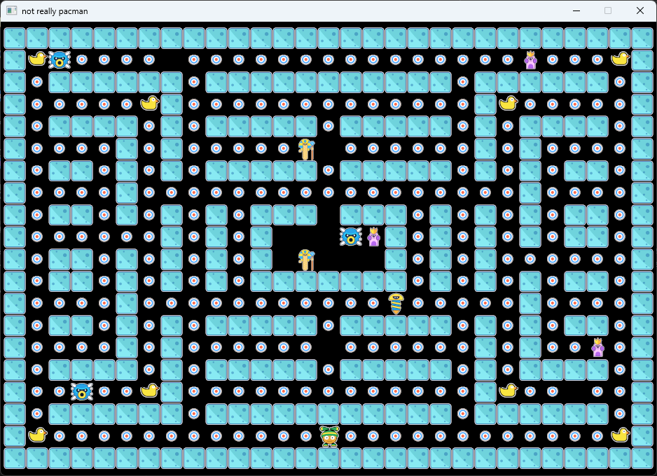

# Pas-Cman



Pas-cman c'est pas pacman. 

Ce repository contient le code source de l'interface du jeu multi-joueur que vous allez devoir 
réaliser dans le cadre de votre projet pour le cours **BINV2182-2: Programmation Distribuée**
à l'Institut Paul Lambin (HE Léonard de Vinci).

Le code source du jeu a été écrit par vos profs adorés, et le jeu complet (dans sa version 
mono joueur) est disponible (ici)[https://github.com/xgillard/pas-cman]. Ce jeu est écrit 
en Rust, et en utilisant une architecture ECS. Il s'agit donc d'un langage de programmation
que vous ne connaissez pas encore, et d'une architecture logicielle que vous n'avez encore
jamais rencontré non plus. 

**CEST POURQUOI NOUS VOUS ENCOURAGEONS ACTIVEMENT A ATTENDRE QUE LE PROJET SOIT FINI AVANT D'ALLER EN LIRE LE CODE**

## Etape 1: Compiler le Jeu

Comme le jeu en lui même n'est pas écrit en _C_ mais en _Rust_ (il s'agit toutefois de deux langages très proches), 
vous allez devoir utiliser le compilateur Rust pour transformer le code source en fichier executable. 
Pour installer ce compilateur, il vous suffit de suivre les instrcutions qui vous sont données sur 
(cette page)[https://www.rust-lang.org/fr/learn/get-started]. Sur votre machine linux, il vous suffira 
sans doute d'exécuter la ligne de code suivante: 

```
curl --proto '=https' --tlsv1.2 -sSf https://sh.rustup.rs | sh
```

Après ca, vous pourrez taper `cargo install --release` dans votre terminal, ce qui aura pour effet de produire un
fichier binaire dans le répertoie `target/release` du projet. Une fois le jeu compilé, vous pourrez copier
ce fichier binaire ainsi que le dossier `resources` qui est nécessaire pour que le jeu puisse s'exécuter
correctement.

### Notes

Afin de compiler le programme sur votre machine linux (ou WSL sur windows), vous aurez sans doute aussi besoin d'installer
les librairies suivantes (si vous utilisez une distribution desktop, il y a de fortes chances que tous ces paquets soient 
déjà préinstallés):
```
sudo install cmake pkg-config libfontconfig-dev librust-servo-fontconfig-sys-dev libwayland-bin libxrandr2 libxi6 libx11-xcb libgl1
```

## Etape 2: Se familiariser avec le protocole du jeu

Dans le fichier `pascman.h`, vos professeurs adorés vous ont fourni la définition des structures qui sont necessaires
afin de pouvoir piloter l'interface de votre jeu depuis un système extérieur. Ce protocole est somme toutes assez
simple: il consiste simplement a envoyer une série de messages (des records binaires) qui sont envoyés à l'interface 
graphique en écrivant sur son entrée standard.

Vous devez donc commencer par aller lire le header qui vous est fourni afin de comprendre le fonctionnement global de
ce protocole et vous familiariser avec les messages utilisés.

### AFIN DE VOUS AIDER A Y VOIR PLUS CLAIR
Afin de vous aider à y voir plus clair, nous vous avons aussi fourni le programme `exemple.c` qui lit un fichier 
comprenant une représentation textuelle de la map et écrit tous les messages nécessaires sur sa sortie standard.
Ce petit programme d'exemple continue ensuite en faisant courir en boucle un méchant derriere le heros.

Vous pourrez donc tester que tout fonctionne bien chez vous en lancant les commandes suivantes:
```
cargo build --release
gcc -o exemple exemple.c
./exemple | ./target/release/pas-cman-ipl
```

## Credits
This game includes artwork by "sethbyrd.com". For more info about this work or its creator, check: "www.sethbyrd.com", 
https://opengameart.org/content/cute-characters-monsters-and-game-assets 
